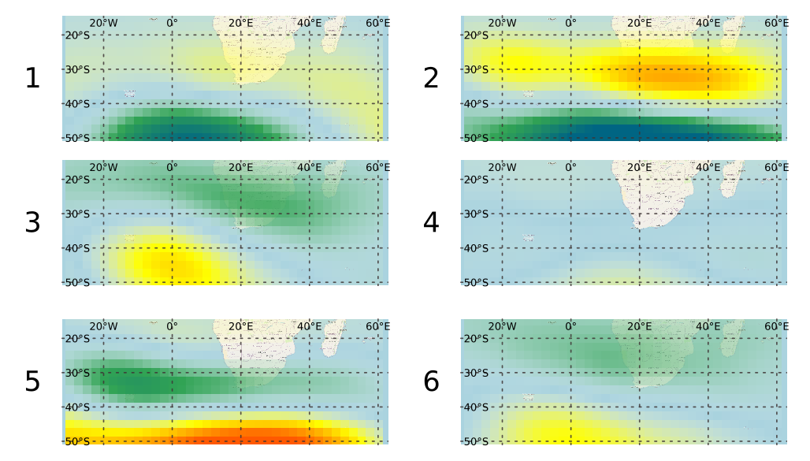
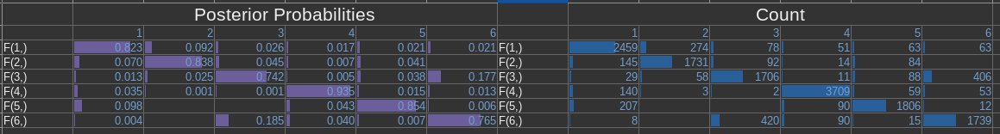
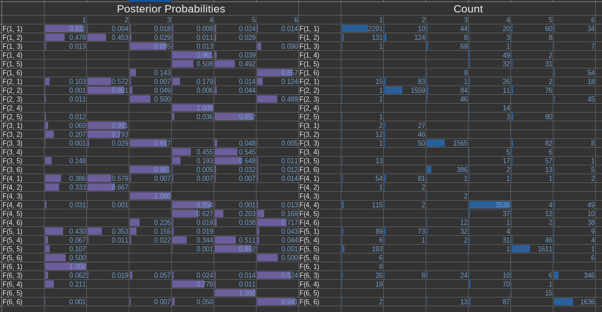

% Principal component analysis on NCEP data

# Objective
We're trying to use NCEP reanalysis 2 data for the weather generator script. We're doing it to help with out study areas in south africa. Since weather weather generator can be reused for different basins our plan is to generate one model and then use it for all the study basins across south africa.

Our Study area range for the weather regimes is:
- lat: -50.0 → -15.0
- lon: 330.0 → 60.0

# TOC  <-- :TOC: -->
- [Objective](#objective)
- [Download and Prepare Anomalies Data](#download-and-prepare-anomalies-data)
  - [Current Method](#current-method)
  - [Previous Method](#previous-method)
- [PCA analysis](#pca-analysis)
- [Kmeans clustering](#kmeans-clustering)
- [Scott's code for Weather regimes](#Scotts-code-for-weather-regimes)
  - [Input data](#input-data)
  - [PCA](#pca)
  - [HMMs](#hmms)
  - [Output](#output)
- [Markov Chain](#markov-chain)
- [Correlations](#correlations)

# Download and Prepare Anomalies Data
## Current Method

### Download
We downloaded the Ncep reanalysis 2 data for the whole world and then used [`nco` tool](http://nco.sourceforge.net/) to crop it and concat it into a single file, then used a python script to calculate the anomaly.

### Crop
The commands to crop and concatenate using nco for example looks like this:

```
ncks -d lat,-50.,-15. -d lon,330.,60. daily-mean-levels/hgt.1979.nc ./4xdaily-cropped/hgt.1979.nc
```

The command was run for all the files `hgt.1979.nc` to `hgt.2022.nc` in a loop (with gnu parallel).

`ncks` is a tool from `nco` it is named NetCDF Kitchen Sink. Here we use `-d` flag that has following use:

```
-d, --dmn, dimension dim,[min][,[max]][,[stride]] Dimension's limits and stride in hyperslab
```

Here we're copying file with cropped using `lat` and `lon` fields. Advantages of using this tool over python is that it automatically understands longitude so we can do "from 330 to 60" whereas in actual dataset they are on two ends of the matrix as it's ordered 0-360.

For more details there are [Some examples here](http://nco.sourceforge.net/nco.html#xmp_ncks) on how to use it.

### Concat
Now cropped data were concatenated into a single file:

```
ncrcat daily-mean-levels/*.nc 4xdaily-mean.nc
```

`ncrcat` is the Concatenator from `nco`.

### Anomaly Calculation
With some clever scripting or more diving to `nco` docs there might have been something to calculate the anomalies here too, but I did it in numpy (in home turf).

The calculation is done in file: <explore-py/netcdf_to_csv.py>

It saves a csv with same name plus `-anomaly` as the input with headers:  `time,lat,lon,delta_hgt`


## Previous Method
Data is downloaded using `NCEP` library, you can download it using:

```R
install.packages("RNCEP")
```

The file `download.r` has the code to download, calculate yearly aggregate and save tabular data. It's made to be run interactively.

# PCA analysis

PCA analysis is done to reduce the dimensionality of the data. It took me a while to understand the dimensions of this data as initially I thought it was like point data with dimensions lat, lon and time. Hence no reason to reduce the dimensionality.

Now I'm come to the conclusion that, the data isn't the point but rather a state, which includes all the gridded data at single time frame. Which means at a single time we have `lat × lon` number of points, and it's a matrix data, hence we have  `lat × lon` dimensions for each data.


# Kmeans clustering
After PCA analysis was done, then those ordinates were used for k means clustering to get N points. After doing the reverse transformation from them, we got the N clusters in original raster format. cluster rasters are in rasters directory.

We tried 6, 8 and 13 clusters with similar results.

# Scott's code for Weather regimes
Scott's code we got is a single file: <weather-gen/identify.simulate.WRs_markovians.R>

The current file is a heavily modified one, but only the syntax was modified the overall logic is the same (the statistical functions are unchanged). You can look over the repository history to get the original code and how it was changed over time. [I might add a separate file (<weather-gen/identify.simulate.WRs_markovians.org.R>) with original code with this commit.]

The steps on the code are as follows:
## Input data
It takes a input data in rds format with tabular value of variables in columns (`lat x lon`) and time in rows. There is no time columns, all the columns are expected to be data for PCA. I've names the column's titles as `lon,lat` to make conversion back to raster easier.

Then the data dates are entered separately and they are used to subset the input data to the required rows of continuous data.

## PCA
First the PCA analysis is done on the input data, then number of PCA to use is chosen and that many columns are extracted.

## HMMs
Hidden markov Model is fit using `depmix` package. Data from which is taken to generate initialization parameters for `s-NHMMs`, there is also seasonality introduced with `-1 + CosT + SinT` that has a time period of 1 year for annual data.

After the initialization is over model is fit. Originally it ran 10 models and chose one of them, I've modified it to end once a model converges to a solution.

## Output
After the model is fitted, we extracted the cluster that all the days fall into, and we also recalculated the raster for each cluster centroids to visualize the clusters in gis. The generated rasters are saved in: <./rasters/kmeans.Scott/>.

There is a qgis file `vis.qgs` if you open it, the layers there are linked to the files generated by the code (depending on number of clusters some of them might be unavailable, ignore those). The Layouts in the qgis files automatically visualizes the clusters. You might have to change the maximum and minimum in the symbology for better patches of high and low anomalies.



# Markov Chain
After we had clusters, and categorization of each points in the time series. Then each pattern was simply counted and then converted to observed probabilities.

We can use it to see if there are some relationships between the clusters.

Results are in the file: [file:./csvs/tables.ods] locally. The visualizations gives following observations:



1 day chain probabilities show higher counts and probabilities for repetition of same cluster in the following day. The cluster 6 and 3 have higher probabilities of occurring after one another.

The Figure of clusters in [Output Section](#output) also shows the pattern for 3 and 6 are similar so numbers and visual observations are in sync here.



There are few interesting patterns here, like some transformation are higher in relation to change than repeating the last one, but looking at the counts those occur too few times to make an actual conclusions. And once again only pattern that has significant count than repeating sequences are (6,3) and (3,6).

# Correlations
We used the precipitation values to see the correlation of weather regimes and precipitation (binned into No precipitation, Low precipitation and High precipitations). As of now the correlation isn't great.

Significant findings from correlation analysis:
- The correlation of clusters with precipitation is very bad (marginal)
- Correlation of clusters from Scott's code was slightly better than simple cluster from kmeans.
- We also did correlation of `precip~month` and it seems to be way better than both of them. Which also suggests the improvement on clusters from Scott's code could be due to the seasonality included in the clustering (which forces/encourages the clusters to occur in nearby months).

Correlations results are explained in details in another file.
